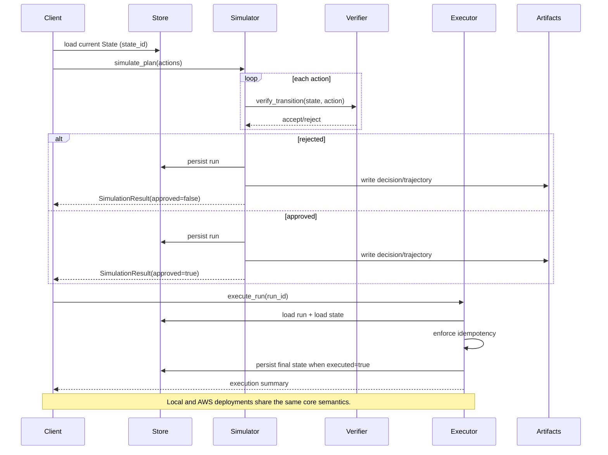

# Beyond Tokens — Builder Lab

Beyond Tokens — Builder Lab is a deployable world-model planning lab with a strict **simulate → verify → commit** flow.

This repository accompanies the **Beyond Tokens** essay series. The essays explain *why*; this repo demonstrates *how*.

https://harveygill.substack.com/p/beyond-tokens

## Who is this for?

This repo is for:
- Architects exploring **world models + agentic systems**
- Traders experimenting with **paper trading + planning agents**
- Researchers interested in **VL-JEPA-style world models applied to markets**

If you find this useful, feel free to ⭐ the repo or open an issue with feedback.

## Why this repository exists

Most AI systems fail not because they are unintelligent, but because they are unaccountable.

They generate fluent reasoning without being forced to confront consequences. Plans are proposed, but not tested. Actions are taken, but not verified. Failures appear only after execution, when rollback is expensive or impossible.

This repository demonstrates a different approach.

It implements a minimal but complete architecture in which:
- state is explicit and inspectable
- actions are simulated before execution
- constraints are enforced at the level of state transitions
- execution only occurs after verification passes

The goal is not to build a trading system.

The goal is to show — concretely — what it takes to turn world-model theory into executable, verifiable systems that behave correctly under planning pressure.

## Staged Versions
- **v1.0 Minimum Viable World Model (local)**
- **v1.1 Executable World Model on AWS**
- **v2 Agent-governed world models (planned)**

## Architecture (Executable World Model)
A minimal world-model pipeline that shares the same core semantics locally and in the cloud.

Artifacts now include `decision.json`, `trajectory.json`, and `deltas.json` for each run.

The planner is provider-neutral and untrusted: it only proposes a plan, while simulation and verification remain authoritative.

## Sequence (Plan → Simulate → Verify → Execute)


AWS mapping: State/Run/Policy stores map to DynamoDB tables. Artifacts live in an S3 prefix, and entry points are Lambda handlers (simulate/execute/status).

Planner insertion (proposes, never executes): Planner → simulate_plan → verify → artifacts → execute_run.

## How this maps to the Beyond Tokens essay series

The capstone essay, **Essay 5**, is the recommended entry point for builders: https://harveygill.substack.com/p/beyond-tokens. It presents the executable architecture and links directly to the companion repo: https://github.com/MaverickHQ/executable-world-models.

Essays 1–4 are the foundations that explain *why* this architecture exists: Essay 1 frames the accountability gap, Essay 2 defines world models and state, Essay 3 formalizes planning under constraints, and Essay 4 motivates verification before execution.

## Setup

This repo is **local-first**. You can run setup/lint/tests without AWS credentials.
AWS/CDK actions are optional and should be run explicitly when you're ready.
`cdk-deploy` is not part of the baseline workflow.

```bash
make setup
```

## Lint

```bash
make lint
```

## Tests

```bash
make test
```

## Local Demo

```bash
make demo-local
```

## Local Demo (Planner)

```bash
make demo-local-planner
```

## Strategies (v0.3)

Executable-world-models includes a JSON strategy spec that emits BUY/SELL/HOLD signals.
Strategies live under `examples/strategies/` and are evaluated deterministically against
the canonical price-path fixture.

Run the local strategy demo:

```bash
make demo-local-strategy
```

Available examples:
- `examples/strategies/threshold_demo.json`
- `examples/strategies/sma_crossover_demo.json`
- `examples/strategies/mean_reversion_demo.json`

## Trade Tape Demo (Pack 11 / v0.4)

The trade tape demo runs the strategy → simulate → verify → execute loop and
produces shareable artifacts (tape.json, tape.csv, report.md).

```bash
make demo-local-tape
```

**What you should see**
- Deterministic trade tape rows per step
- A mix of HOLD/APPROVED/REJECTED decisions
- Report and tape artifacts under `tmp/demo_local_tape/`

## Local loop (strategy → simulate → verify → execute)

The local loop runs the strategy across a market path, writes the trade tape,
persists execution events from a local paper broker, and records an execution ledger.

```bash
make demo-local-loop
python3 scripts/replay_executions.py --executions tmp/demo_local_loop/executions.json
```

**What you should see**
- Trade tape table followed by execution events and an execution ledger
- Approved executions only in the ledger
- Artifacts under `tmp/demo_local_loop/`

## Optional: Bedrock Planner (v2.1)

The Bedrock planner proposes a plan only; verification remains authoritative.
It cannot bypass simulator/verifier checks.

```bash
ENABLE_BEDROCK_PLANNER=1 AWS_REGION=us-east-1 \
BEDROCK_MODEL_ID=anthropic.claude-3-haiku-20240307-v1:0 \
make demo-local-bedrock
```

**What you should see**
- Scenario A prints two actions using fixture prices and is rejected.
- Scenario B prints two actions using fixture prices and is approved.
- Each scenario prints a non-empty explanation line.
- Artifact paths are printed.

Do not commit environment files; export variables in your shell and keep `.env` files out of git (covered by `.gitignore`).

## AWS Demo

```bash
AWS_PROFILE=beyond-tokens-dev make cdk-synth
AWS_PROFILE=beyond-tokens-dev make cdk-deploy
AWS_PROFILE=beyond-tokens-dev make demo-aws
```

## AWS Planner Demo (v2.2)

```bash
AWS_PROFILE=beyond-tokens-dev make cdk-deploy
AWS_PROFILE=beyond-tokens-dev make demo-aws-planner
AWS_PROFILE=beyond-tokens-dev make smoke-aws-planner
```

**What you should see**
- Scenario A prints two fixture-priced actions and is rejected.
- Scenario B prints two fixture-priced actions and is approved.
- Each scenario prints a non-empty explanation line.
- Artifact prefixes are printed (no AWS identifiers).

## What you should see
- Scenario A rejects with clear verification errors.
- Scenario B approves and executes with updated state.
- Each scenario prints a short explanation line derived from deterministic verification.

## One-command checks
```bash
make lint
make test
make demo-local
```

## 10-minute evaluation (baseline)
```bash
make setup
make lint
make test
make cdk-synth
```

## How to evaluate this repository in 10 minutes
1. Plans are not executed directly.
2. Every plan is simulated step-by-step against explicit state.
3. Invalid plans are rejected before execution with reasons.
4. Deterministic artifacts are produced (trajectory, deltas, policy version, explanation).
5. Execution only occurs after verification passes.
